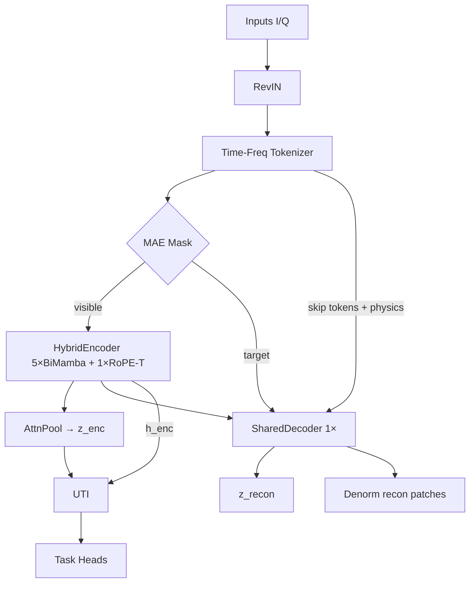
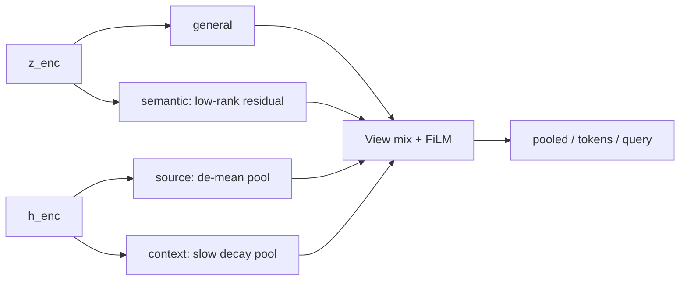

# ResMamba Signal Model — 架构绘图蓝图（Scheme）

本文档给出可直接交给绘图工具（Illustrator / draw.io / Figma / TikZ / AI 绘图）的**详细绘图方案**。视觉风格对齐 Vaswani et al., *Attention Is All You Need*（2017）中的 Transformer 架构图（Figure 1）。

实现对应主类：`SignalFoundationModel`（`resmamba_signal_model.models.model`）。

> **与当前代码对齐（2026-08）：** 分类身份为 Encoder **GatingPool → `z_enc`**；Decoder 出 `z_recon` 仅作重建/物理 readout。预训练与下游 **`build_task_interface=false`（无 UTI）**。下文若仍出现 UTI / semantic·source·context 色块，仅作历史/可选对照图元，**勿画进正式训练路径总览**。权威叙述见 [`README.md`](../README.md)。

---

## 0. 全局视觉规范（对齐 Transformer 论文图）

### 0.1 画布与版式

| 项目 | 规范 |
|------|------|
| 画布比例 | 竖向为主；总览图可用横版「左 Encoder / 右 Decoder」双塔 |
| 数据流 | **自下而上**（输入在底、输出在顶），与论文 Figure 1 一致 |
| 背景 | 纯白或极浅灰 `#FAFAFA`，无渐变、无阴影堆叠 |
| 模块盒 | 圆角矩形（圆角 ≈ 4–6 px），细黑描边 `#222`，线宽 1.5–2 pt |
| 填充 | 同层同类模块统一浅色填充；不同语义用不同浅色（见色板） |
| 文字 | 无衬线（Helvetica / Arial / Source Sans）；模块标题 10–12 pt 加粗；副注 8–9 pt |
| 箭头 | 实线箭头，线宽 1.25 pt，黑色；**残差旁路**用细线绕开主盒再汇入 Add |
| 堆叠标注 | 用右侧竖括号 + `N×`（如 `5×`、`1×`），与论文 Encoder/Decoder 的 `N×` 一致 |
| 禁止 | 3D、霓虹、图标插画、emoji、过度圆角胶囊、多色渐变块 |

### 0.2 推荐色板（浅色、论文风）

| 语义 | 填充 HEX | 用途 |
|------|----------|------|
| 输入 / I/Q | `#F5F5F5` | Inputs、波形 |
| 归一化 / Norm | `#E8F0FE` | RevIN、Add & Norm、RMSNorm |
| 时域 / Mamba | `#E6F4EA` | Stem、BiMamba、DecoderBlock |
| 频域 / Attention | `#FEF3C7` | FFT、Multi-Head / Cross-Attn、RoPE Memory |
| 融合 / Gate | `#F3E8FF` | Gate、FiLM、skip |
| 物理 / Physics | `#FFE4E6` | Physics bias、能量投影 |
| 读出 / Pool | `#E0F2FE` | AttnPool、`z_enc` / `z_recon` |
| UTI 视图 | `#ECFDF5` | semantic / source / context |
| 输出头 | `#FFF7ED` | Task heads、recon patches |

### 0.3 符号约定（所有图共用）

| 符号 | 含义 |
|------|------|
| `⊕` / **Add** | 残差相加（可画成小圆 ⊕ 或写 `Add`） |
| **Add & Norm** | 残差后接 Norm（论文式：先画子层，旁路再汇入 Add & Norm） |
| `N×` | 右侧大括号标注堆叠层数 |
| 虚线框 | 可选模块（如 phase_plugin、domain GRL） |
| 粗箭头 | 主张量流；细箭头 = 条件 / 旁路 / mask |
| `[B,2,L]` 等 | 张量形状用小号等宽字体标注在箭头旁 |

### 0.4 默认超参（图注可用小号字写出）

```
d_model = 640
patch_size = 16
Encoder: 5 × BiMamba2 + 1 × RoPE MemoryTransformer
Decoder: 1 × DecoderBlock (BiMamba2 + SwiGLU) + UnifiedQueryDecoder
UTI rank = 64
```

---

## 1. 总览图 Scheme — Overall Architecture

**建议文件名**：`fig_overall_architecture.svg`  
**布局**：单栏竖向流水线（推荐），或双塔「Encode ↔ Decode」+ 底部 Tokenizer / 顶部 UTI。

### 1.1 画板分区（自上而下）

```
┌─────────────────────────────────────────────┐
│  Task Heads / UTI Readouts（输出区）          │
├─────────────────────────────────────────────┤
│  Universal Task Interface (UTI)             │
├──────────────────┬──────────────────────────┤
│  Encoder Identity│  SharedDecoder           │
│  z_enc / h_enc   │  z_recon + recon patches │
├──────────────────┴──────────────────────────┤
│  HybridEncoder（可见 token MAE encode）      │
├─────────────────────────────────────────────┤
│  Time-Freq Tokenizer                        │
├─────────────────────────────────────────────┤
│  RevIN（normalize observed I/Q）             │
├─────────────────────────────────────────────┤
│  Inputs: I/Q [B,2,L] + sample_mask          │
└─────────────────────────────────────────────┘
```

### 1.2 模块盒清单（自下而上）

1. **Inputs**  
   - 标签：`Inputs`  
   - 副注：`I/Q waveform [B, 2, L]`，`sample_mask`  
   - 风格：浅灰盒，类似论文底部 `Inputs`

2. **RevIN**  
   - 标签：`RevIN`  
   - 副注：`normalize (observed-only stats)` → `iq_norm`；旁路保存 `stats` 供 denorm  
   - 右侧细箭头：`stats → Denorm / Energy Project`（画到 Decoder 输出区）

3. **Tokenizer**  
   - 标签：`Time-Freq Tokenizer`  
   - 副注：`shared stem + multi-scale time + complex FFT bands`  
   - 输出箭头：`tokens [B, N, D]`，`patch_mask`，`patch_physics`

4. **MAE Mask**（小菱形或细盒，夹在 Tokenizer 与 Encoder 之间）  
   - 标签：`Mask (MAE / span / suffix)`  
   - 分叉：  
     - `visible` → Encoder  
     - `target_mask` → Decoder query / recon loss（细虚线）

5. **HybridEncoder**（大框 + 右侧 `6×` 拆成 `5×` + `1×`）  
   - 内嵌两段：  
     - 绿盒堆叠：`BiMamba2` ×5，括号 `5×`  
     - 黄盒：`RoPE Memory Transformer` ×1，括号 `1×`  
   - 输出：`h_vis`（可见位置隐状态）

6. **Encoder Identity Readout**（浅蓝）  
   - 流程：`scatter → AttnPool(visible) → LayerNorm`  
   - 输出标签加粗：`z_enc`（= `z_general` / `z`）  
   - 旁注（重要）：`reuse MAE encode; no second full-sequence encode`  
   - 并行输出：`h_enc`（scatter 后的 encoder token 图）

7. **SharedDecoder**（右塔或下方大框）  
   - 子步骤纵向：  
     1. `Scatter + Mask Token`  
     2. `Gated Skip (from tokenizer tokens)`  
     3. `Physics FiLM`（仅 visible）  
     4. `[DEC] ∥ patch tokens` → `DecoderBlock ×1`  
     5. `Unified Query Decoder` → `recon_norm`  
     6. `[DEC]+AttnPool → z_recon`  
   - 右侧细箭头：`RevIN denorm + energy project → recon patches`

8. **UTI**  
   - 输入：`z_enc`, `h_enc`, `patch_mask(visible)`  
   - 三视图：`semantic` / `source` / `context`  
   - 输出：`pooled` / `tokens` / `query` → Task Heads

9. **Outputs**（顶部，仿论文 Softmax）  
   - 分类：`Modulation / Emitter heads`（吃 UTI pooled 或指定 view）  
   - 重建：`I/Q patches`（denorm 空间）  
   - 可选虚线：`Domain GRL` 仅接 `semantic` 低秩视图

### 1.3 关键残差 / 旁路（必须画出）

| 旁路 | 从 | 到 | 画法 |
|------|----|----|------|
| Tokenizer skip | `tokens` | Decoder `Gated Skip` | 右侧竖向细箭头 |
| Physics | Tokenizer `patch_physics` | Decoder FiLM | 粉色细箭头 |
| RevIN stats | RevIN | Denorm | 左侧竖虚线 |
| `z_enc` 身份 | Encoder pool | UTI + VICReg / 分类身份 | 粗蓝箭头 |
| `z_recon` | Decoder repr | 物理 readout（非分类身份） | 细蓝箭头 |

### 1.4 图注（脚注 3 行）

```
Encoder layout: M–M–M–M–M–T. Classification identity = z_enc (AttnPool on visible).
Reconstruction identity = z_recon ([DEC] + AttnPool). UTI specialist views ≠ three copies of adapter(z).
Pretrain does not inject dataset_id into Decoder/UTI condition.
```

### 1.5 ASCII 线框（供 AI / TikZ 对齐）

```text
                         ┌──────────────────────┐
                         │   Task Heads / Soft  │
                         │   outputs            │
                         └──────────▲───────────┘
                                    │
                         ┌──────────┴───────────┐
                         │  UTI (multi-view)    │
                         │  semantic│source│ctx │
                         └──────────▲───────────┘
                    z_enc,h_enc     │
                         ┌──────────┴───────────┐
           ┌─────────────┤                      ├─────────────┐
           │  z_enc      │                      │  z_recon    │
           │  AttnPool   │   SharedDecoder      │  + recon    │
           │  (visible)  │   1× DecBlock       │  patches    │
           └──────▲──────┤   + QueryDecoder     ├──────▲──────┘
                  │      └──────────▲───────────┘      │
                  │                 │ skip+FiLM        │ denorm
           ┌──────┴─────────────────┴──────┐           │
           │  HybridEncoder                │           │
           │  ┌─────────────────────────┐  │           │
           │  │ BiMamba2  ×5            │  │           │
           │  │ RoPE Memory Trans. ×1   │  │           │
           │  └─────────────────────────┘  │           │
           └──────────────▲────────────────┘           │
                          │ visible tokens             │
           ┌──────────────┴────────────────┐           │
           │  Time-Freq Tokenizer          │───────────┘
           └──────────────▲────────────────┘   (tokens skip)
                          │
           ┌──────────────┴────────────────┐
           │  RevIN                        │···· stats ····
           └──────────────▲────────────────┘
                          │
                     Inputs (I/Q)
```

---

## 2. Tokenizer Scheme — TimeFreqTokenizer

**建议文件名**：`fig_tokenizer.svg`  
**布局**：底部输入 → 中部分叉（Time / Freq）→ 顶部 Gate 融合（仿论文「双支汇入」）。

### 2.1 整体结构

```
                    tokens [B,N,D]
                          ▲
                    LayerNorm + Dropout
                          ▲
              ┌───────────┴───────────┐
              │ + PhysicsProj (opt)   │  ← patch_physics [B,N,P]
              │ + PhaseProj (opt,虚线) │
              └───────────┬───────────┘
                          ▲
                 Gate ⊙ Time + (1-Gate) ⊙ Freq
                          ▲
              ┌───────────┴───────────┐
              │  σ( Linear([T‖F]) )   │  Gate
              └───────────┬───────────┘
                    ┌─────┴─────┐
                    │           │
              Time branch   Freq branch
                    ▲           ▲
              Stem+DW-MS     Patch FFT
                    │           │
                    └─────┬─────┘
                          │
                 iq_norm [B,2,L]
```

### 2.2 左支：Time Path（绿色系）

自下而上盒：

1. **Stem**：`Conv1d(2 → C, k=7, pad=3)`，`C = stem_channels (64)`  
2. **Multi-scale Depthwise**：并排 4 个小盒  
   - `DWConv k∈{4,8,16,32}`，`stride = patch_size`，`groups = C`  
   - 上方横条：`Concat → Conv1d 1×1 → d_model`（`time_fuse`）  
3. 输出：`time_tok [B, N, D]`

### 2.3 右支：Freq Path（黄色系）

自下而上盒：

1. **Patchify**：`iq → patches [B, N, 2, P]`，`P = patch_size`  
2. **Complex FFT**：`z = I + jQ` → `fft` → `log|·|` → **`fftshift`**  
3. **Band Pool**：双侧频谱均分 `freq_bands = 8`  
4. **Linear**：`freq_bands → d_model` → `freq_tok`

### 2.4 融合与偏置

| 步骤 | 标签 | 说明 |
|------|------|------|
| Gate | `Gated Fusion` | `gate = σ(W [time‖freq])`；`tok = g⊙time + (1-g)⊙freq` |
| Physics | `+ Physics Bias` | `Linear(PHYS_DIM → D)`；特征含 log_power / PAPR / IQ corr / var ratio / spectral centroid |
| Phase | `+ Phase Plugin`（虚线框） | 相对相位增量 + 相邻共轭相关 → `Linear(4 → D)` |
| Norm | `LayerNorm` | 后接 Dropout；`~patch_mask` 置零 |

### 2.5 输出端口（右侧小标签）

- `tokens`  
- `patch_mask` / `token_mask`  
- `iq_patch_targets`  
- `patch_physics` + `physics_mask`

### 2.6 绘图要点

- **无** dataset / task token 注入（图中勿画 task embedding）。  
- Time / Freq 左右对称，中间 Gate 用紫色浅盒，类似论文中 Add 汇合点。  
- 在 Freq 支路旁用小号字写：`keep negative freqs; fftshift then equal bands`。

---

## 3. Encoder Scheme — HybridEncoder + Identity Pool

**建议文件名**：`fig_encoder.svg`  
**布局**：严格模仿论文左侧 Encoder 塔：底部输入 → 重复层 → 顶部 Norm / Pool。

### 3.1 外层塔结构

```
                 z_enc [B,D]
                      ▲
              LayerNorm (encoder_repr_norm)
                      ▲
              Attention Pooling (learnable query)
                      ▲
              h_enc (scatter to full length; pool on visible)
                      ▲
         ┌────────────┴────────────┐
         │  Final RMSNorm          │
         └────────────▲────────────┘
                      │
         ┌────────────┴────────────┐  ⎫
         │ Memory Transformer ×1   │  ⎬ 1×
         │ (RoPE Multi-Head Attn   │  ⎭
         │  + FFN; optional chunk  │
         │   mean memory)          │
         └────────────▲────────────┘
                      │
         ┌────────────┴────────────┐  ⎫
         │ BiMamba2 Block          │  │
         │ (bidirectional scan)    │  ⎬ 5×
         │ + residual / norm       │  │
         └────────────▲────────────┘  ⎭
                      │
              visible tokens [B,N_vis,D]
              (sequence packing optional)
```

### 3.2 BiMamba2 Block 内部（放大 inset，可选附图）

仿论文「Multi-Head Attention」子图风格，竖向：

```
x ──► RMSNorm ──► BiMamba2 (fwd ∥ bwd) ──► ⊕ ──► out
 ▲                                         │
 └─────────────────────────────────────────┘
```

标注：`d_state=64, d_conv=4, expand=2, headdim=64`。

### 3.3 Memory Transformer Block 内部（必画 inset）

完全按论文 Encoder layer 画法：

```
          ┌─────────────────────┐
     ┌───►│ Multi-Head Attention│───┐
     │    │   + RoPE on Q,K     │   │
     │    └─────────────────────┘   │
     │              │               │
x ───┤            Add & Norm ◄──────┘
     │              │
     │    ┌─────────▼─────────┐
     └───►│ Feed Forward      │───┐
          │ (expand ×2, GELU) │   │
          └───────────────────┘   │
                    │             │
                 Add & Norm ◄─────┘
                    │
                   out
```

**长序列旁注**（虚线小框）：  
`if L > attn_window (1024): chunk-mean memory tokens → attend → broadcast`。

### 3.4 Identity Readout（与骨干同图顶部，或右侧 callout）

```
h_vis ──scatter(+ mask_token on masked)──► h_enc
h_enc ──AttnPool(query★, keys=visible)──► z_enc
```

要点文字框（黄底小注）：

> MAE：只 encode **visible**；`z_enc` 由可见 token 池化得到，**不对全序列二次 encode**。  
> 下游无 mask：对全部有效 patch 池化。

### 3.5 与论文图的对应关系

| Transformer Encoder | 本模型 Encoder |
|---------------------|----------------|
| `N×` identical layers | `5×` BiMamba2 + `1×` MemoryTransformer（异构，勿画成 6 个相同盒） |
| Multi-Head Attention | MemoryTransformer 中的 RoPE MHA |
| Feed Forward | MemoryTransformer FFN；Mamba 层用 SSM 替代 Attn |
| 顶层输出 | 另加 AttnPool → `z_enc`（论文无此；需单独标出） |

---

## 4. Decoder Scheme — SharedDecoder

**建议文件名**：`fig_decoder.svg`  
**布局**：模仿论文右侧 Decoder 塔，但内容为「1 层上下文 Mamba + 坐标 Query Cross-Attn」，**不要**画成自回归 masked self-attn 堆叠。

### 4.1 主塔（自下而上）

```
     recon patches (denorm I/Q)     z_recon
              ▲                        ▲
     RevIN Denorm + Energy Proj   ReprHead
              ▲                   ([DEC]‖AttnPool)
              │                        │
     ┌────────┴────────┐               │
     │ Unified Query   │───────────────┘
     │ Decoder         │  (recon_norm, query_h)
     └────────▲────────┘
              │ patch_h, visible keys
     ┌────────┴────────┐
     │ DecoderBlock ×1 │  ⎫
     │ BiMamba2+SwiGLU │  ⎬ 右侧括号 1×
     └────────▲────────┘  ⎭
              │
     tokens = [DEC] ∥ h0
              ▲
     ┌────────┴────────┐
     │ Physics FiLM    │ ← patch_physics (visible only)
     └────────▲────────┘
     ┌────────┴────────┐
     │ Gated Skip      │ ← tokenizer tokens (visible)
     └────────▲────────┘
     ┌────────┴────────┐
     │ Scatter Encoder │
     │ + Mask Token    │ ← h_vis, visible, patch_mask
     └────────▲────────┘
         h_vis from Encoder
```

### 4.2 DecoderBlock 内部（inset）

```
x ──► BiMamba2 ──► ⊕(x) ──► RMSNorm ──► SwiGLU ──► ⊕ ──► out
```

标注：`Pre-LN；恰好 1 层；无 Decoder Transformer 堆叠`。

### 4.3 Unified Query Decoder 内部（inset，论文 Cross-Attn 风格）

```
Query 构造:
  coord_proj([pos, target_flag])
  + physics_proj(context_physics)
  + condition_proj(task_context)   ← 预训练默认可不画 dataset
  + gate · context_proj(patch_h)   ← local_query_gate，零初始化

然后（仿论文 Decoder 的 Encoder-Decoder Attention）:

  Q ──► Multi-Head Cross-Attention ◄── K,V = visible context
              │
           Add & Norm
              │
           FFN (GELU)
              │
           Add & Norm
              │
           Linear → ΔI/Q patch + local_recon(patch_h)
```

Key masking：`key_padding_mask = ~(patch_mask & visible)`。

### 4.4 读出语义（必须在图上区分）

| 向量 | 来源 | 用途 | 画法 |
|------|------|------|------|
| `z_enc` | Encoder AttnPool | **分类身份** | 不在 Decoder 塔内作为主输出 |
| `z_recon` | `[DEC]` + AttnPool(+patch) | **重建 / 物理 readout** | Decoder 塔顶主输出之一 |
| `recon_norm` | QueryDecoder | MAE / 物理损失 | 再经 denorm |

脚注：

> `z_recon` 不作分类身份；分类走 `z_enc` / UTI views。

### 4.5 Physics FiLM 小公式盒

```
γ, β = MLP(physics)
h ← (tanh(γ)+1) · h + β    (仅 visible 位置)
```

---

## 5. UTI Scheme — Universal Task Interface (v2)

**建议文件名**：`fig_uti.svg`  
**布局**：左「Views 工厂」、中「Condition」、右「Modulate + Readout」三列，仍保持白底细线论文风。

### 5.1 输入

- `z_general` = `z_enc`  
- `h_general` = `h_enc`  
- `patch_mask`（MAE 时与 `visible` 对齐）  
- `TaskSpec`（family / readout / view / modality / metadata）

### 5.2 左列：Specialist Views（勿画成三份相同 adapter）

```
h_enc, z_enc
    │
    ├─► general: (z_enc, h_enc)          —— 直通
    │
    ├─► semantic: LowRankResidual(z_enc / h_enc)
    │             （低秩残差专家，默认 domain GRL 约束此视图）
    │
    ├─► source:  h' = h - mean(h)
    │            pool(h') → LowRankResidual
    │            （去均值 token 残差 → 个体/源特征）
    │
    └─► context: slow exponential decay pool (decay≈0.95)
                 → LowRankResidual
                 （慢变量上下文）
```

三个视图盒用绿色浅底，标题分别写 `semantic` / `source` / `context`；箭头旁写聚合算子名称。

### 5.3 中列：Condition Vector

```
Embed(family) + Embed(readout) + Embed(view) + Embed(modality)
+ MLP(metadata) [+ domain_prompt(dataset_id) 虚线/下游]
        │
        ▼
   LayerNorm → condition [B, rank]
```

### 5.4 视图混合

```
logits = ViewGate(condition)  masked by TaskSpec.allowed_views
weights = softmax
z_mix = z + Σ w_i (z_i - z)
h_mix = h + Σ w_i (h_i - h)
```

### 5.5 右列：Modulate + Readouts（仿论文顶层 Softmax 前的 Linear）

```
Houlsby Stem → FiLM(condition) residual  ⇒  z_h, tok_h

Readouts:
  pooled: z_h + σ(pool_gate)·mean(tok_h)
          → L2-normalize residual mix
  tokens: tok_h
  query:  tok_h + MLP(coords)
```

任务默认视图（小表，可放图脚）：

| Task | view | readout |
|------|------|---------|
| modulation | semantic | pooled |
| emitter | source | pooled |
| clustering | mixed | pooled |
| pretrain | general | query |

### 5.6 Domain GRL（可选虚线支路）

```
z_semantic ──GRL──► Domain Discriminator
```

旁注：`梯度不进入 z_enc；仅约束 UTI 声明不变的低秩视图（默认 semantic）`。

### 5.7 禁止画错的点（检查清单）

- [ ] 不是 `adapter(z)` 复制三份  
- [ ] `semantic` = 低秩残差(`z_enc`)  
- [ ] `source` = 去均值再池化  
- [ ] `context` = 慢衰减池化  
- [ ] 预训练条件默认 **无** `dataset_id`

---

## 6. 分图交付清单（给绘图工具的任务包）

按优先级依次出图：

| # | 文件 | 内容 | 画幅建议 |
|---|------|------|----------|
| 1 | `fig_overall_architecture` | §1 总览 | 竖版 A4 / 1200×1800 px |
| 2 | `fig_tokenizer` | §2 | 竖版或宽版 1400×1000 |
| 3 | `fig_encoder` | §3 + BiMamba/Transformer inset | 竖版 1000×1600 |
| 4 | `fig_decoder` | §4 + QueryDecoder inset | 竖版 1000×1600 |
| 5 | `fig_uti` | §5 三列 | 横版 1600×1000 |

每张图右下角统一署名式图注：

```
ResMamba Signal Model  |  style after Vaswani et al. 2017 Fig.1
```

---

## 7. 给 AI 绘图工具的英文 Prompt 模板（可直接粘贴）

### 7.1 Overall

```
Draw a clean scientific architecture diagram in the style of the
"Attention Is All You Need" Transformer figure (Vaswani et al. 2017):
white background, thin black rounded rectangles, bottom-to-top data flow,
residual bypass arrows, no 3D, no neon. Title: Signal Foundation Model.

Bottom to top blocks:
1) Inputs I/Q [B,2,L]
2) RevIN normalize
3) Time-Freq Tokenizer
4) MAE mask split into visible vs target
5) HybridEncoder: five BiMamba2 blocks (Nx=5) then one RoPE Memory
   Transformer (Nx=1)
6) Attention Pooling to z_enc (classification identity)
7) SharedDecoder: mask token scatter, gated skip, Physics FiLM,
   [DEC] token + one DecoderBlock, Unified Query Decoder to recon,
   AttnPool to z_recon
8) UTI multi-view (semantic/source/context) to task heads

Use light pastel fills: green for Mamba, yellow for attention,
blue for pooling, pink for physics. Label tensors on arrows.
```

### 7.2 Tokenizer

```
Scientific diagram, Attention-Is-All-You-Need paper style, white background.
Time-Freq Tokenizer: input iq_norm splits into Time branch
(Conv stem + four depthwise multi-scale kernels 4/8/16/32 fused to d_model)
and Freq branch (complex FFT, log-mag, fftshift, 8-band pool, linear).
Gated fusion, optional physics bias and phase plugin, LayerNorm.
Bottom-to-top arrows, thin boxes, pastel green/yellow/purple.
```

### 7.3 Encoder

```
Encoder stack diagram like Transformer paper left tower: bottom visible
tokens enter five stacked BiMamba2 blocks (bracket 5x), then one
RoPE Multi-Head Attention + FFN Memory Transformer block (bracket 1x),
final RMSNorm, then learnable-query Attention Pooling to vector z_enc.
Inset: standard Pre-LN attention block with Add & Norm. Clean, minimal.
```

### 7.4 Decoder

```
Decoder tower in Transformer-paper style but custom content: scatter
encoder states with mask tokens, gated skip from tokenizer, Physics FiLM,
prepend [DEC] token, one BiMamba2+SwiGLU block, then cross-attention
Unified Query Decoder (queries from coordinates+physics; keys=visible)
producing recon patches; [DEC]+pool yields z_recon. Bottom-to-top, Nx=1.
```

### 7.5 UTI

```
Three-column scientific figure, paper style. Left: build views from
encoder z_enc/h_enc — semantic low-rank residual, source mean-removed
pooling, context exponential decay pooling. Center: task condition
embeddings. Right: view mix, Houlsby stem + FiLM, pooled/token/query
readouts. Not three identical adapters. White background, thin boxes.
```

---

## 8. Mermaid 参考（可预览结构；最终出版图请按 §0–§5 精绘）

### 8.1 Overall flow



### 8.2 UTI views



---

## 9. 验收自检（绘图完成后对照）

- [ ] 数据流自下而上，白底细线，有 `N×` 括号  
- [ ] Encoder 为 **M-M-M-M-M-T**，不是 6 个相同 Attention  
- [ ] Decoder **仅 1** 层；有 `[DEC]`、FiLM、Query Cross-Attn  
- [ ] `z_enc` ≠ `z_recon` 角色已标注  
- [ ] Tokenizer 无 task/dataset token  
- [ ] UTI 三视图聚合方式不同  
- [ ] Domain GRL 只画在 semantic（若出现）  
- [ ] 风格可一眼联想到 Vaswani 2017 Figure 1

